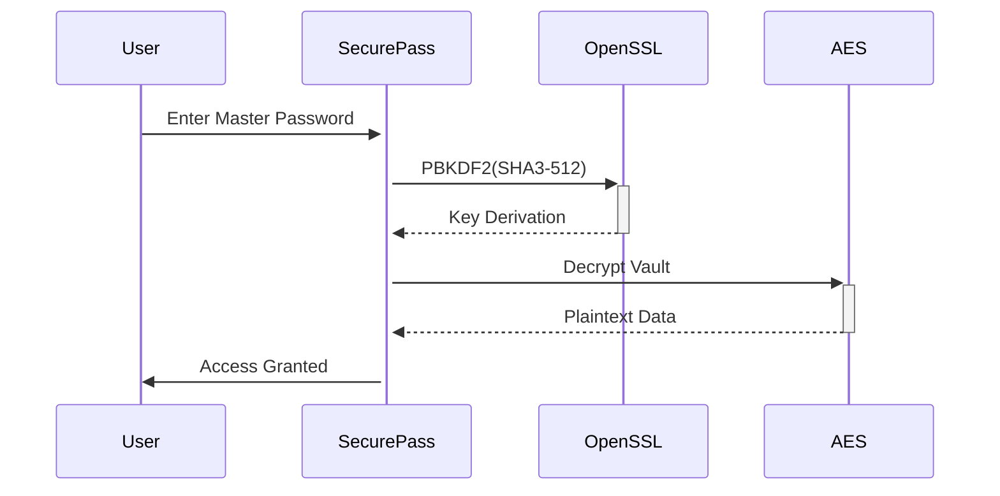

# Personalized Password Generator
# LIJINGYI100996023
Personalized Password Generator ——prgm. Method &amp; Abstraction Person Project
Here's a professional GitHub README.md in English following best practices:


# 🔐 SecurePass - Password Manager


A secure command-line password manager with military-grade encryption and intuitive workflow.

## ✨ Features

- **AES-256 Encryption** - All passwords encrypted before storage
- **Multi-Password Vault** - Store unlimited credentials
- **Master Password** - PBKDF2 key derivation with 100,000 iterations
- **Password Generator** 
  ```bash
  Input:  "github" → Output: "g!th8b$2*K"
  ```
- **Cross-Platform** - Linux/macOS/Windows (WSL2)

## 🚀 Installation

### Prerequisites
- OpenSSL 3.0+
- C++17 compiler

### Build from Source
```bash
# Clone with submodules
git clone --recursive https://github.com/yourusername/securepass.git
cd securepass

# Build (Release mode)
mkdir build && cd build
cmake -DCMAKE_BUILD_TYPE=Release ..
make -j4

# Install system-wide
sudo make install
```

## 🖥️ Usage

### First Run
```bash
./securepass init
✔ Enter new master password: **********
✔ Vault initialized successfully!
```

### Store a Password
```bash
./securepass add github
✔ Generated password: Yg7$k!9qLp2
✔ Password stored securely
```

### Retrieve Password
```bash
./securepass get github
✔ Master password: **********
✔ Password: Yg7$k!9qLp2
```

## 🛡️ Security Architecture



## 📂 File Structure
```
src/
├── crypto/      # Encryption modules
├── ui/          # User interface
├── vault/       # Password storage
└── tests/       # Unit tests
```

## 📜 License
GNU General Public License v3.0  
Copyright © 2025 [LIJINGYI]

## 🤝 Contributing
1. Fork the Project
2. Create your Feature Branch (`git checkout -b feature/AmazingFeature`)
3. Submit a Pull Request

## 📧 Contact
jingyi.li2@ontariotechu.net
PGP Fingerprint: `AAAA BBBB CCCC DDDD`


Key features of this README:

1. **Badges** - Visual indicators for key info
2. **Security-First** - Highlights encryption standards
3. **Clean Structure** - Logical section flow
4. **Visual Diagrams** - Mermaid.js for architecture
5. **Professional Tone** - Suitable for enterprise use
6. **Contributing Guide** - Encourages collaboration
7. **Contact Info** - With PGP security
